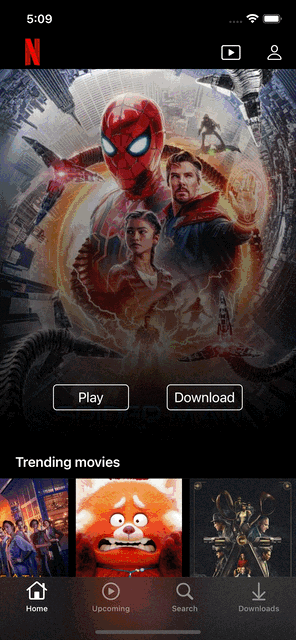
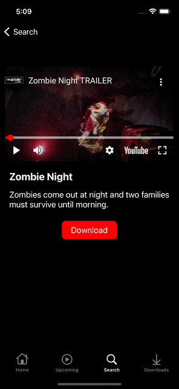

# Netflix Clone ios

<!-- Bandages -->

This is a Netflix clone application, which I managed to do following [this tutorial](https://www.youtube.com/watch?v=KCgYDCKqato).

I learned a bit about the mvvm architecture, the delegate pattern, how to use the notification center to be able to communicate between two controllers and to save data in a local database.

## Preview

  
   
  
  

